
<a href=https://www.youtube.com/watch?v=y1ql5D7sgC0&list=PL5ED86276C6DB1347&index=7>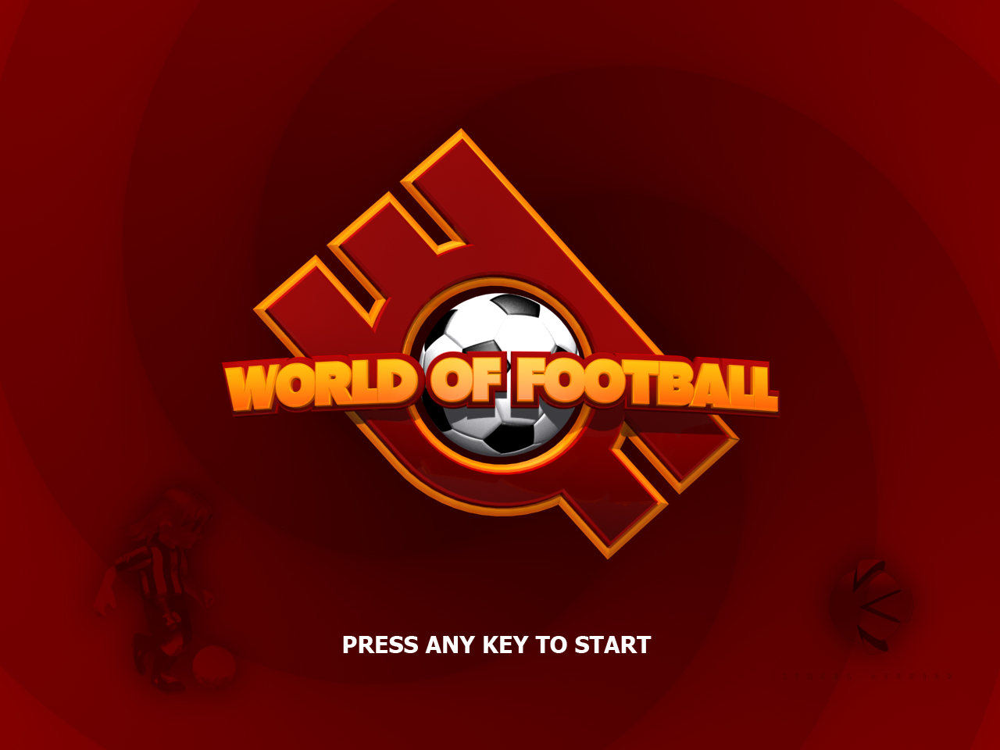</a>

This is a developer backup copy of __World of Football__, a computer game that was never released. It was designed by [Dennis Hansen](https://www.linkedin.com/in/denniskhanhansen/) and developed [Jad Nohra](https://www.linkedin.com/in/jadnohra/) between the years 2006 and 2008. The game was not a commercial project.

The idea of the game was to bring back the gameplay of old soccer game classics, based on skill using the controller, and away from canned special moves, but using relatively modern (at the time) 3D graphics. Manually creating special moves was possible using the novel concept of __circle-of-control__ invented by Dennis. A basic example of the concept in action can be seen [here](https://youtu.be/y1ql5D7sgC0?list=PL5ED86276C6DB1347&t=46).

## Directory Structure

A a bit of information to help navigating the backup:

The game engine was built from scratch with almost no usage of third party code or libraries, it was called _Witch Engine_ found in _[WitchEngine3/src/WE3](WitchEngine3/src/WE3)_. On top, an editor was built called _Evil Eye_ found in _[WitchEngine3/src/EE](WitchEngine3/src/EE)_. Based on both, the game itself _World of Football_. Aside from the source code folder _[WOF2/src](WOF2/src)_, of interest are the assets found in _[WOF2/deploy/assets](WOF2/deploy/assets)_, including the AI scripts found in _[WOF2/deploy/assets/script](WOF2/deploy/assets/script)_.

<a href=https://www.youtube.com/watch?v=y1ql5D7sgC0&list=PL5ED86276C6DB1347&index=7>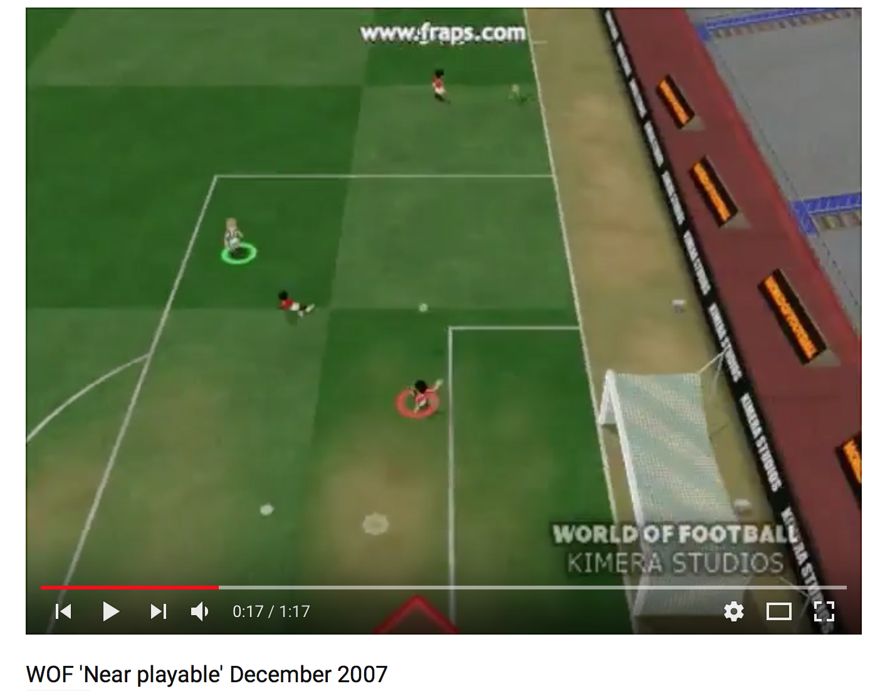</a>

## Technically
 * The engine used DirectX9's fixed-function pipeline
 * Hardware accelerated instancing and skeletal animation
 * Mutliple spatial acceleration structures
 * A micro-collision based physics engine, including air-drag and approximate soft-body ball physics
 * High-level game logic, as well as player AI was built on top of a scripting language with bindings into the game
 * Player AI used a predictive model to estimate ball trajectories, adapting itself to the physics parameters
 * Assets were expressed in xml
 * A generic input device framework was used, abstracting away the actual controller from the input logic and allowing easy remapping without changing source code
 * Custom collision detection, math and container libraries
 * Imagemagick was used to procedurally generate billboards
 * Multiplayer gameplay over the internet was supported

## Media
Videos and screenshots of features, developments, and silly stuff, are in the directory _[Media](Media)_. Here is a partial gallery: 

|   | 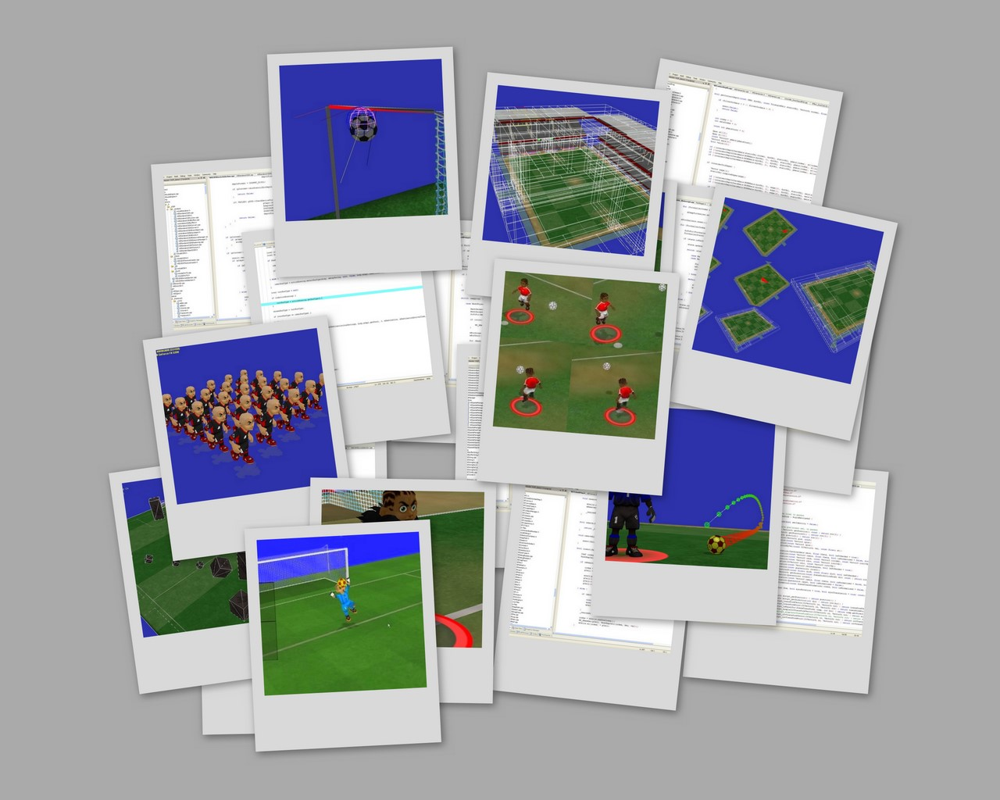  |   |
|---|---|---|
| 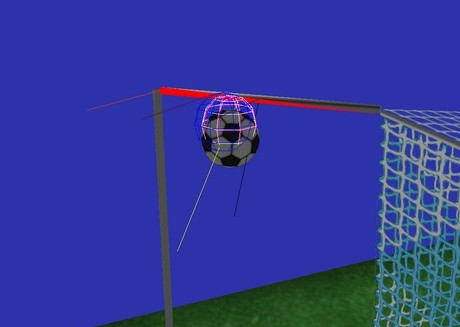 | 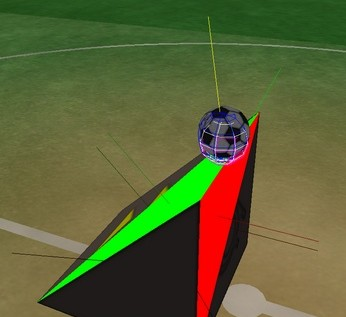  | 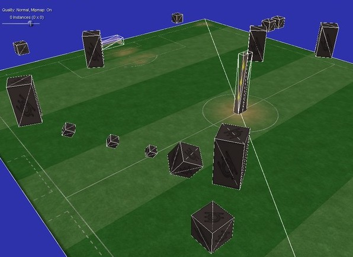  |
|  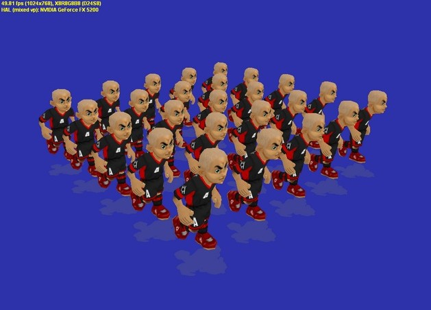 | 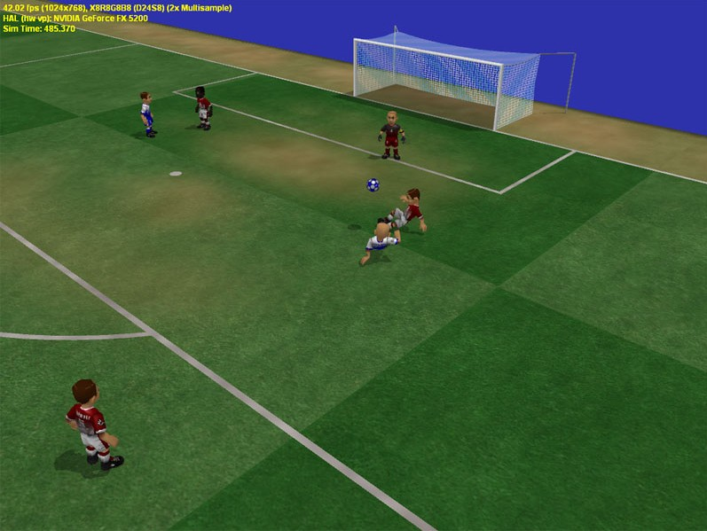  | 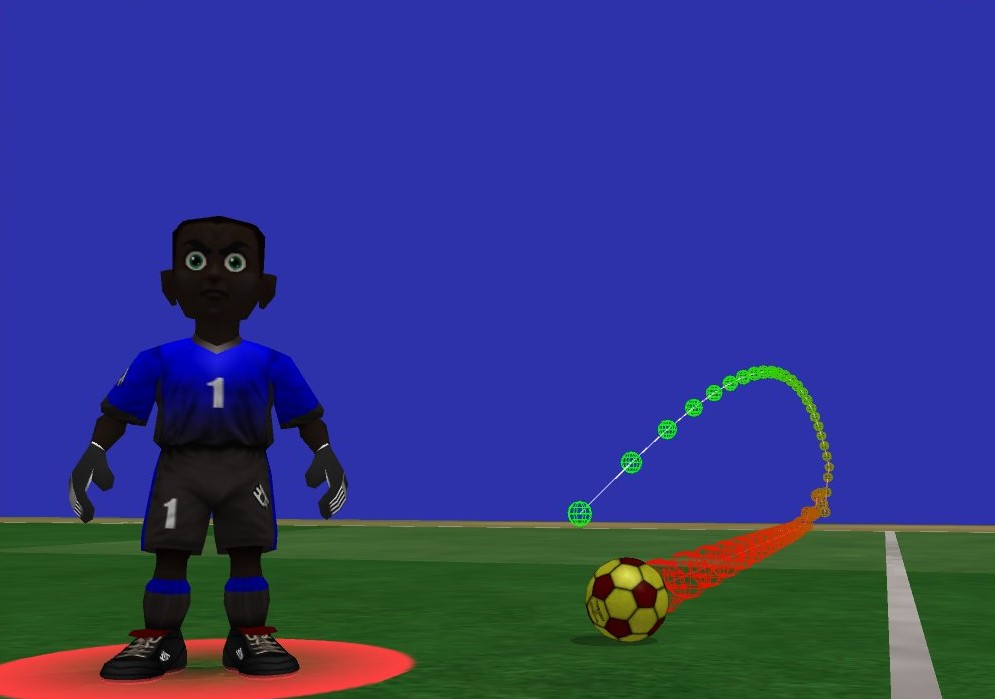  |
| 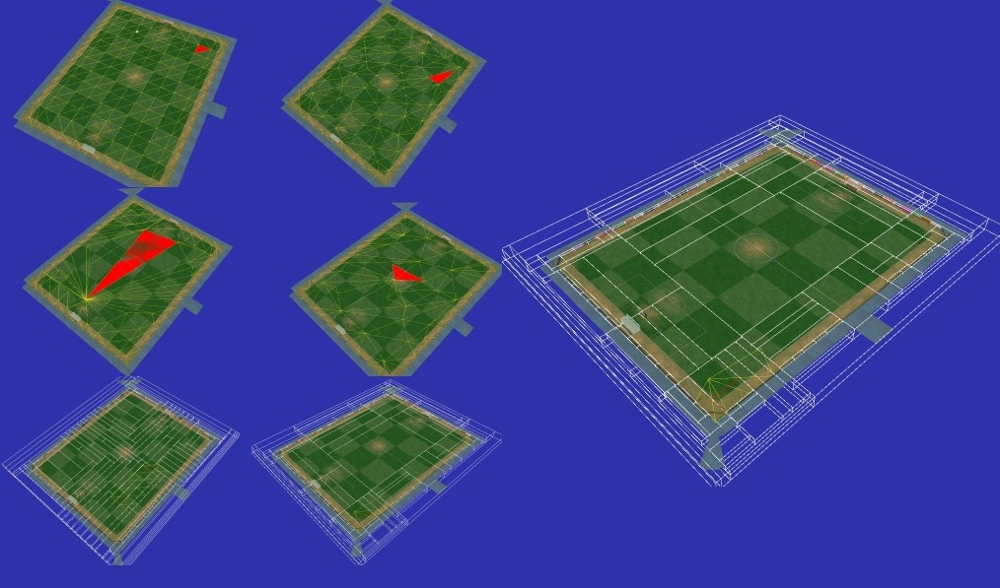  |   | 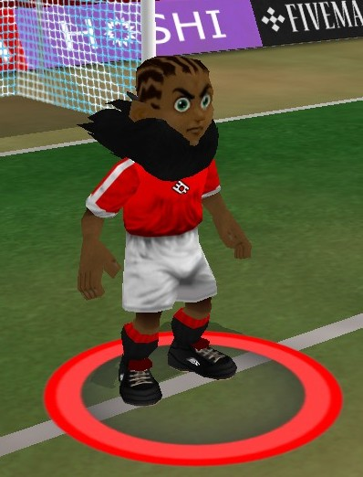  |
